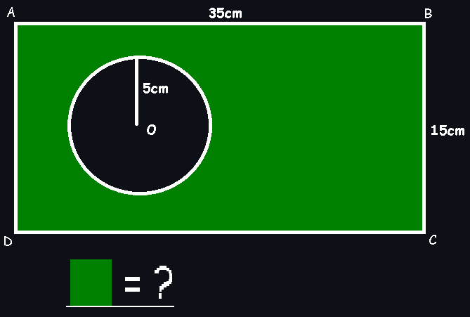

# LZAR

  [](https://github.com/sanalzio/lzar/releases)

## Table of Contents
- [LZAR](#lzar)
  - [Table of Contents](#table-of-contents)
  - [❔ What is the LZAR?](#❔-what-is-the-lzar)
  - [❔🔧 How to use?](#❔🔧-how-to-use)
    - [Using with system arguments](#using-with-system-arguments)
    - [Or you can use with only lzar](#or-you-can-use-with-only-lzar)
  - [✔ Installation](#✔-installation)
    - [❔ Which release should I use?](#❔-which-release-should-i-use)
      - [With this table you can select the release you need to use.](#with-this-table-you-can-select-the-release-you-need-to-use)
      - [But what is the "x86" and "x64" in the table above?](#but-what-is-the-x86-and-x64-in-the-table-above)
    - [What is the "-node" releases?](#what-is-the--node-releases)
  - [🎨 Usage Examples](#🎨-usage-examples)
  - [Total lines of code...](#total-lines-of-code)
  - [☕ Buy me a coffee](#☕-buy-me-a-coffee)
  - [📝 LICENSE](#📝-license)


## ❔ What is the LZAR?

**Lzar** is a very simple, very fast program that gives importance to the priority of operations, and in which you can do more than just addition, subtraction, multiplication and division.

## ❔🔧 How to use?
### Using with system arguments
```bash
lzar "1+1"

lzar "1+2*3"

lzar "((1+2)+3)+4"

lzar "[1+2*3+(4-5)*6/7]/2"

lzar "(30*15)-(PI*5^2)"

lzar "3!*2"
```

### Or you can use with only lzar
```bash
$ lzar
> 1+1
2

> (30*15)-(PI*5^2)
371.46018366025515

> 3!*2
12

> █
```

> [!TIP]
> Press <kbd><kbd>Ctrl</kbd> **+** <kbd>C</kbd></kbd> to exit the program.

## ✔ Installation
> [!IMPORTANT]
> **You can donwload the latest release from the [releases page](https://github.com/sanalzio/lzar/releases).**

### ❔ Which release should I use?
The answer to this question depends on your operating system and processor type.

#### With this table you can select the release you need to use.
| OS | Processor | Release |
| --- | --- | --- |
| Windows | x64 | lzar-win-64.exe |
| Windows | x86 | lzar-win-32.exe |
| Linux | x64 | lzar-linux-64 |
| Linux | x86 | lzar-linux-32 |
| macOS | x64 | lzar-mac-64 |

#### But what is the "x86" and "x64" in the table above?
"x86" means the 32-bit version of the program and "x64" means the 64-bit version of the program.

### What is the "-node" releases?
I am currently learning go language and I wrote this program to make what I learned in go language permanent. But since I am not very knowledgeable in go language, <ins>I first wrote this program on **node.js** and then translated it into go language, so I wrote it for both languages. I added it so that anyone who wants to use the release written in **node.js** can also use it.</ins>

## 🎨 Usage Examples
```bash
lzar "1+1"

lzar "1+2*3"

lzar "((1+2)+3)+4"

lzar "[1+2*3+(4-5)*6/7]/2"

lzar "(30*15)-(PI*5^2)"

lzar "3!*2"
```

```bash
$ lzar
> 1+1
2

> 1+2*3
7

> ((1+2)+3)+4
10

> [1+2*3+(4-5)*6/7]/2
3.0714285714285716

> 3!*2
12

> █
```



```bash
$ lzar
> (30*15)-(PI*5^2)
371.46018366025515

> █
```

## Total lines of code...
<ins>for node version:</ins> **99**

<ins>for go version:</ins> **121**

## ☕ Buy me a coffee
<a href="https://www.buymeacoffee.com/sanalzio"></a>

## 📝 LICENSE
GPL-V3

Thanks to the [**egonelbre/gophers**](https://github.com/egonelbre/gophers) repository for gophers.

